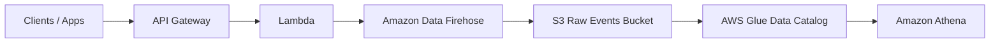
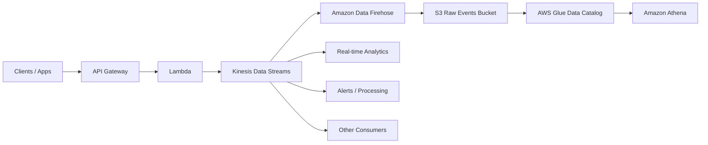

# Event Collector Service

The Event Collector Service receives application events through an HTTP API, processes them using AWS Lambda, buffers and delivers them through Amazon Data Firehose, stores them in Amazon S3, and will eventually make them queryable using AWS Glue and Amazon Athena.

The current implementation runs locally using Floci.

## Architecture

### Current Flow



The current ingestion flow is:

```text
Clients / Apps
      ↓
API Gateway
      ↓
Lambda
      ↓
Amazon Data Firehose
      ↓
Amazon S3
      ↓
AWS Glue
      ↓
Amazon Athena
```

Firehose sits between Lambda and S3 so that individual events can be buffered and written to S3 as larger objects instead of creating one S3 object per event.

## Components

### API Gateway

API Gateway exposes the HTTP endpoint used by applications to send events.

```text
POST /events
```

### Lambda

The Lambda function receives the API Gateway request, extracts the event payload, and sends the event to Firehose.

The Lambda does not write directly to S3.

```text
API Gateway
    ↓
Lambda
    ↓
Firehose PutRecord
```

### Amazon Data Firehose

Firehose buffers incoming events and periodically writes them to the raw events S3 bucket.

The current buffering configuration is:

```ts
bufferingHints: {
  intervalInSeconds: 60,
  sizeInMBs: 5,
},
```

Firehose attempts to deliver buffered records when either:

```text
60 seconds have passed
OR
5 MiB of data has accumulated
```

whichever happens first.

Records are compressed using GZIP before being written to S3.

### Amazon S3

S3 stores the raw event data.

The current bucket is:

```text
event-collector-service-raw-events
```

Successful Firehose deliveries use time-based prefixes:

```text
events/
  year=2026/
    month=09/
      day=11/
        hour=22/
```

Failed Firehose deliveries are written under:

```text
errors/
```

### AWS Glue

AWS Glue will be used to catalog the event data stored in S3 and define the schema and partitions required by Athena.

This part of the pipeline has not been implemented yet.

### Amazon Athena

Athena will be used to query the event data stored in S3 using SQL.

This part of the pipeline has not been implemented yet.

## Future Architecture with Kinesis

Kinesis Data Streams can be added later if the service requires real-time processing, multiple independent consumers, or event replay.



Without Kinesis, the architecture is simpler:

```text
Lambda → Firehose → S3 → Glue → Athena
```

This is suitable when the primary requirement is to collect events and store them for later analytics.

With Kinesis:

```text
                    ┌→ Real-time Analytics
                    ├→ Alerts / Processing
Lambda → Kinesis ───┼→ Other Consumers
                    │
                    └→ Firehose → S3 → Glue → Athena
```

Kinesis provides a durable real-time event stream that can support multiple consumers, replay, real-time analytics, alerts, and other streaming workloads. Firehose can continue consuming the stream and delivering the events efficiently to S3.

For now, the service uses the simpler **Lambda → Firehose → S3** architecture.

# Running Locally with Floci

The service is deployed locally using Floci.

AWS-style API Gateway URLs such as:

```text
https://<api-id>.execute-api.us-east-1.amazonaws.com
```

will not resolve locally because Floci exposes AWS services through:

```text
http://localhost:4566
```

## Health Check

Verify that Floci is running:

```bash
curl http://localhost:4566/_floci/health
```

## Invoke the Events API

The event collector exposes:

```text
POST /events
```

Use the Floci API Gateway endpoint:

```bash
curl -i -X POST \
  'http://localhost:4566/execute-api/<api-id>/$default/events' \
  -H 'Content-Type: application/json' \
  -d '{
    "eventType": "test_event",
    "appId": "test-app",
    "userId": "123"
  }'
```

Example:

```bash
curl -i -X POST \
  'http://localhost:4566/execute-api/f987ff2baa/$default/events' \
  -H 'Content-Type: application/json' \
  -d '{
    "eventType": "test_event",
    "appId": "test-app",
    "userId": "123"
  }'
```

The `$default` stage is used because the `HttpApi` created by CDK uses the default API Gateway stage.

A successful request should return:

```text
202 Accepted
```

This indicates that the event was accepted by the Lambda and sent to Firehose.

# Verify Events in S3

List the raw events bucket:

```bash
aws s3 ls \
  s3://event-collector-service-raw-events \
  --recursive \
  --endpoint-url http://localhost:4566
```

Objects should appear under prefixes similar to:

```text
events/year=2026/month=09/day=11/hour=22/
```

Because Firehose buffers records, objects may not appear immediately after sending an event.

# Load Testing

The load test script sends multiple events concurrently to the API Gateway endpoint.

## Setup

Create and activate a Python virtual environment:

```bash
python3 -m venv .venv
source .venv/bin/activate
```

Install dependencies:

```bash
pip install requests
```

## Run a Load Test

Send 1000 events:

```bash
python load_test.py 1000
```

By default, the script uses 20 concurrent workers.

To change the number of workers:

```bash
python load_test.py 1000 --workers 40
```

Example output:

```text
Sending 1000 events
Workers: 20
URL: http://localhost:4566/execute-api/f987ff2baa/$default/events

Results
-------
Total:           1000
Successful:      986
Failed:          14
Total time:      22.47s
Average latency: 988.54ms
Requests/sec:    44.51
Status codes:    {"200": 986, "ERROR": 14}

Errors
------
7x ReadTimeout: HTTPConnectionPool(host='localhost', port=4566): Read timed out. (read timeout=10)
```

## Read Timeout Errors

A `ReadTimeout` means that the connection to Floci was established successfully, but the client did not receive a complete HTTP response within the configured timeout.

```text
Client
  ↓
Connection established to localhost:4566
  ↓
Request sent
  ↓
Floci / API Gateway / Lambda processing
  ↓
No response within 10 seconds
  ↓
ReadTimeout
```

This usually indicates that the local environment is becoming saturated under concurrent load.

The timeout can be increased:

```python
response = requests.post(url, json=payload, timeout=30)
```

Or separate connection and response timeouts can be configured:

```python
response = requests.post(url, json=payload, timeout=(2, 30))
```

This means:

```text
2 seconds  → establish connection
30 seconds → wait for response
```

Timeouts should still be counted as failed requests during load testing.

## Testing Different Concurrency Levels

Run the same number of events with different worker counts:

```bash
python load_test.py 1000 --workers 5
python load_test.py 1000 --workers 10
python load_test.py 1000 --workers 20
python load_test.py 1000 --workers 40
```

Compare:

```text
Requests/sec
Average latency
Failed requests
Timeouts
```

This helps identify the concurrency level at which the local Floci environment begins to saturate.
