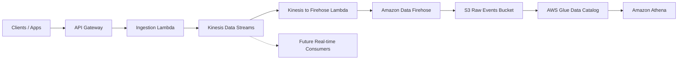
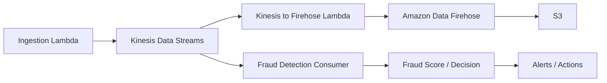

# Event Collector Service

## 1. Overview

The Event Collector Service receives application events through an HTTP API, validates them, streams them through AWS services, stores them in Amazon S3, and makes them available for analytics through Amazon Athena.

The service is currently developed and tested locally using Floci.

The current architecture is:



The main event flow is:

```text
Client
  ↓
API Gateway
  ↓
Ingestion Lambda
  ↓
Kinesis Data Streams
  ↓
Kinesis → Firehose Lambda
  ↓
Amazon Data Firehose
  ↓
Amazon S3
  ↓
AWS Glue
  ↓
Amazon Athena
```

---

## 2. Goals

The service is designed to:

* Receive events through a simple HTTP API.
* Validate incoming event schemas.
* Keep both valid and invalid events.
* Use Kinesis as the central event stream.
* Store raw events in S3.
* Avoid writing one S3 object per event.
* Make stored events queryable using Athena.
* Allow real-time consumers to be added later.
* Support high event volumes in the future.
* Keep ingestion and downstream processing decoupled.

The initial implementation focuses on building and validating the complete pipeline. Performance optimization and large-scale throughput testing can be added once the full flow is stable.

---

## 3. Architecture

### 3.1 API Gateway

API Gateway exposes the event ingestion endpoint:

```text
POST /events
```

Clients send events as JSON.

Example:

```json
{
  "eventType": "bank_transaction",
  "eventId": "evt-1",
  "transactionId": "txn-1",
  "accountId": "account-1",
  "cardId": "card-1",
  "merchantId": "amazon",
  "transactionType": "PURCHASE",
  "channel": "ECOMMERCE",
  "amount": 125.50,
  "currency": "USD",
  "country": "US",
  "deviceId": "device-1",
  "ipAddress": "10.0.0.1",
  "timestamp": "2026-09-14T19:30:00Z",
  "expectedFraud": false
}
```

API Gateway forwards the request to the ingestion Lambda.

---

### 3.2 Ingestion Lambda

The ingestion Lambda performs lightweight processing before publishing the event to Kinesis.

```text
Receive request
     ↓
Parse JSON body
     ↓
Validate event schema
     ↓
Tag event as valid / invalid
     ↓
Publish event to Kinesis
     ↓
Return 202 Accepted
```

The Lambda does not write directly to S3 or Firehose.

This keeps the API-facing part of the system small and decoupled from downstream storage and analytics.

---

## 4. Schema Validation

Incoming events are validated before being published to Kinesis.

The validator checks:

* Required fields.
* Field data types.
* Basic value constraints.

A valid event is tagged with:

```json
{
  "schemaStatus": "valid",
  "schemaErrors": []
}
```

An invalid event is still accepted:

```json
{
  "schemaStatus": "invalid",
  "schemaErrors": [
    "Missing required field: accountId"
  ]
}
```

Invalid events are not dropped.

Keeping them allows us to:

* Identify broken producers.
* Measure schema validation failures.
* Debug ingestion problems.
* Query invalid events later using Athena.

---

## 5. Amazon Kinesis Data Streams

Kinesis is the central event stream.

```text
Ingestion Lambda
      ↓
   Kinesis
      ↓
Downstream consumers
```

The current stream uses:

```text
ON_DEMAND
```

capacity mode.

This allows AWS to manage the stream capacity automatically.

### Why Kinesis?

Without Kinesis, the service could use:

```text
Lambda → Firehose → S3
```

This would work if the only requirement was storing events for later analysis.

Kinesis adds a durable streaming layer:

```text
                     ┌→ Fraud Detection
                     ├→ Real-time Analytics
Lambda → Kinesis ────┼→ Alerts
                     ├→ Other Consumers
                     │
                     └→ Storage Pipeline → S3 → Athena
```

This allows multiple consumers to process the same events independently.

For example, a fraud detection service can later process banking transactions directly from Kinesis while the storage pipeline continues writing the same transactions to S3.

Kinesis also provides retention and replay capabilities, which allow consumers to reprocess events when required.

---

## 6. Kinesis to Firehose Lambda

The second Lambda acts as a bridge between Kinesis and Firehose.

```text
Kinesis
   ↓
Kinesis Event Source Mapping
   ↓
Forwarder Lambda
   ↓
Firehose PutRecordBatch
   ↓
Firehose
```

The Lambda receives Kinesis records in batches and forwards them to Firehose using `PutRecordBatch`.

The event source mapping is configured as:

```ts
kinesisToFirehoseLambda.addEventSource(
  new KinesisEventSource(eventsStream, {
    startingPosition: StartingPosition.LATEST,
    batchSize: 100,
  }),
);
```

### 6.1 Kinesis Batch Processing

Kinesis stores records individually.

It does not directly send a batch of records to Lambda.

Instead, AWS Lambda creates an **event source mapping** that continuously polls the Kinesis stream.

```text
Kinesis records
      ↓
Lambda Event Source Mapping
      ↓
Poll records from Kinesis
      ↓
Group records into a batch
      ↓
Invoke Forwarder Lambda
```

The `batchSize` setting controls the maximum number of Kinesis records that can be included in one Lambda invocation.

```ts
batchSize: 100
```

means:

```text
Up to 100 Kinesis records
          ↓
One Forwarder Lambda invocation
          ↓
One Firehose PutRecordBatch request
```

The Lambda does not wait until exactly 100 records are available.

For example:

```text
10 records available  → Lambda may receive 10
50 records available  → Lambda may receive 50
100+ records available → Lambda receives up to 100 per batch
```

The default Kinesis Lambda batch size is:

```text
100 records
```

so the current configuration explicitly uses the default value.

The default batching window is:

```text
0 seconds
```

This means Lambda does not intentionally wait additional time to collect a larger batch. It processes records as they become available.

Batch processing is useful because the forwarder Lambda can send the received records to Firehose using:

```text
PutRecordBatch
```

instead of sending every record individually.

For example:

```text
100 Kinesis records

Instead of:

100 Lambda invocations
100 Firehose PutRecord calls

We can have:

1 Lambda invocation
1 Firehose PutRecordBatch call
```

This reduces the number of Lambda invocations and downstream API calls.

### 6.2 Starting Position

The `startingPosition` setting controls where the Lambda consumer starts reading when the event source mapping is created.

The current configuration uses:

```ts
startingPosition: StartingPosition.LATEST
```

`LATEST` means the consumer starts with new records arriving after the consumer becomes active.

For example:

```text
Event A
Event B
Event C

---------------- Consumer starts here ----------------

Event D
Event E
Event F
```

With:

```text
LATEST
```

the consumer starts with:

```text
Event D
Event E
Event F
```

and does not process the older records first.

The main starting position options are:

```text
LATEST
Start with new records.

TRIM_HORIZON
Start from the oldest record still retained in Kinesis.

AT_TIMESTAMP
Start from records around a specific timestamp.
```

For the current storage pipeline, `LATEST` is used because the forwarder Lambda should process new events arriving after the consumer is deployed.

If an existing Kinesis backlog needs to be replayed later, `TRIM_HORIZON` or a timestamp-based starting position can be used depending on the requirement.

### 6.3 Why is there a Lambda between Kinesis and Firehose?

On AWS, Firehose can consume directly from Kinesis:

```text
Kinesis → Firehose → S3
```

However, the current Floci CloudFormation implementation does not correctly provision a Firehose delivery stream with `KinesisStreamAsSource`.

Even when CDK generates the correct CloudFormation configuration, Floci creates the Firehose delivery stream as:

```text
DirectPut
```

To keep the complete pipeline testable locally, the current design uses:

```text
Kinesis
   ↓
Forwarder Lambda
   ↓
Firehose DirectPut
```

The forwarder Lambda consumes records from Kinesis and sends them to Firehose explicitly.

This keeps Kinesis as the central stream, so additional consumers such as fraud detection can still be added independently.

The additional Lambda is mainly an integration bridge for the current local environment.

When running on AWS, the architecture can later be simplified to:

```text
Kinesis → Firehose → S3
```

if the extra Lambda is no longer required.

---

## 7. Amazon Data Firehose

Firehose receives batches of events from the Kinesis-to-Firehose Lambda and delivers them to S3.

```text
Forwarder Lambda
      ↓
PutRecordBatch
      ↓
Firehose
      ↓
Buffer
      ↓
Compress
      ↓
S3
```

The current buffering configuration is:

```ts
bufferingHints: {
  intervalInSeconds: 60,
  sizeInMBs: 5,
},
```

Firehose attempts delivery when either:

```text
60 seconds have passed
OR
5 MiB has accumulated
```

whichever occurs first.

This avoids creating one S3 object for every event.

Events are compressed using:

```text
GZIP
```

before being stored.

---

## 8. Amazon S3

S3 is the long-term storage layer for raw event data.

The raw events bucket is:

```text
event-collector-service-raw-events
```

Firehose stores successful deliveries using time-based prefixes:

```text
events/
  year=2026/
    month=09/
      day=14/
        hour=19/
```

Example:

```text
s3://event-collector-service-raw-events/events/year=2026/month=09/day=14/hour=19/
```

Failed Firehose deliveries are stored under:

```text
errors/
```

Athena query results are stored separately in:

```text
event-collector-service-athena-results
```

---

## 9. AWS Glue Data Catalog

Glue stores metadata describing the event files stored in S3.

The Glue database is:

```text
event_collector
```

The table is:

```text
raw_events
```

The table points to:

```text
s3://event-collector-service-raw-events/events/
```

The Glue table describes:

* S3 location.
* File format.
* Compression.
* Event columns.
* Data types.

Athena uses this metadata to interpret the files stored in S3.

---

## 10. Amazon Athena

Athena provides SQL access to the stored event data.

The Athena workgroup is:

```text
event-collector-service-workgroup
```

Example:

```sql
SELECT *
FROM event_collector.raw_events
LIMIT 10;
```

Count events:

```sql
SELECT count(*)
FROM event_collector.raw_events;
```

Find invalid events:

```sql
SELECT *
FROM event_collector.raw_events
WHERE schemaStatus = 'invalid';
```

Athena reads the event files directly from S3.

---

## 11. Permissions

The main permission relationships are:

```text
Ingestion Lambda
      │
      │ kinesis:PutRecord / PutRecords
      ▼
   Kinesis
      │
      │ GetRecords / GetShardIterator
      ▼
Forwarder Lambda
      │
      │ firehose:PutRecordBatch
      ▼
   Firehose
      │
      │ S3 write
      ▼
      S3
```

The ingestion Lambda does not have S3 or Firehose permissions.

The forwarder Lambda can read from Kinesis and write to Firehose.

Firehose writes to the raw events S3 bucket using its own IAM role.

---

## 12. Running Locally with Floci

The service is currently developed against Floci.

Floci exposes AWS-compatible services at:

```text
http://localhost:4566
```

### Health Check

```bash
curl http://localhost:4566/_floci/health
```

Check the running Floci version:

```bash
floci version
```

---

## 13. Testing the Events API

The local API endpoint uses:

```text
http://localhost:4566/execute-api/<api-id>/$default/events
```

Example:

```bash
curl -i -X POST \
  'http://localhost:4566/execute-api/<api-id>/$default/events' \
  -H 'Content-Type: application/json' \
  -d '{
    "eventType": "bank_transaction",
    "eventId": "evt-1",
    "transactionId": "txn-1",
    "accountId": "account-1",
    "cardId": "card-1",
    "merchantId": "amazon",
    "transactionType": "PURCHASE",
    "channel": "ECOMMERCE",
    "amount": 125.50,
    "currency": "USD",
    "country": "US",
    "deviceId": "device-1",
    "ipAddress": "10.0.0.1",
    "timestamp": "2026-09-14T19:30:00Z",
    "expectedFraud": false
  }'
```

A successful request returns:

```text
202 Accepted
```

This means the event was accepted and published to Kinesis.

---

## 14. Verifying Kinesis

List streams:

```bash
aws kinesis list-streams \
  --endpoint-url http://localhost:4566
```

The expected stream is:

```text
event-collector-service-events-stream
```

Inspect the stream:

```bash
aws kinesis describe-stream-summary \
  --stream-name event-collector-service-events-stream \
  --endpoint-url http://localhost:4566
```

---

## 15. Verifying the Forwarder Lambda

The forwarder Lambda is:

```text
event-collector-service-kinesis-to-firehose-lambda
```

Watch Floci logs:

```bash
floci logs --follow | grep -Ei 'kinesis|firehose|lambda'
```

The Lambda should log the number of Kinesis records received and the number forwarded to Firehose.

---

## 16. Verifying Firehose

Inspect the delivery stream:

```bash
aws firehose describe-delivery-stream \
  --delivery-stream-name event-collector-service-events-delivery-stream \
  --endpoint-url http://localhost:4566
```

The delivery stream should use:

```text
DirectPut
```

This is expected because the forwarder Lambda explicitly sends records to Firehose.

---

## 17. Verifying S3

List objects:

```bash
aws s3 ls \
  s3://event-collector-service-raw-events \
  --recursive \
  --endpoint-url http://localhost:4566
```

Objects should appear under paths similar to:

```text
events/year=2026/month=09/day=14/hour=19/
```

Firehose buffers events, so objects may not appear immediately.

---

## 18. Verifying Glue

List databases:

```bash
aws glue get-databases \
  --endpoint-url http://localhost:4566
```

List tables:

```bash
aws glue get-tables \
  --database-name event_collector \
  --endpoint-url http://localhost:4566
```

The expected table is:

```text
raw_events
```

---

## 19. Running Athena Queries

Start a query:

```bash
QUERY_ID=$(aws athena start-query-execution \
  --query-string 'SELECT * FROM raw_events LIMIT 10' \
  --query-execution-context Database=event_collector \
  --work-group event-collector-service-workgroup \
  --query 'QueryExecutionId' \
  --output text \
  --endpoint-url http://localhost:4566)
```

Check the state:

```bash
aws athena get-query-execution \
  --query-execution-id "$QUERY_ID" \
  --query 'QueryExecution.Status.State' \
  --output text \
  --endpoint-url http://localhost:4566
```

Retrieve results:

```bash
aws athena get-query-results \
  --query-execution-id "$QUERY_ID" \
  --endpoint-url http://localhost:4566
```

---

## 20. Load Testing

The load test generates synthetic banking transactions and sends them concurrently to the API.

Create a virtual environment:

```bash
python3 -m venv .venv
source .venv/bin/activate
```

Install dependencies:

```bash
pip install requests
```

Send 1,000 transactions:

```bash
python load_test.py 1000
```

Use a different concurrency level:

```bash
python load_test.py 1000 --workers 40
```

Generate synthetic fraud:

```bash
python load_test.py 10000 --workers 40 --fraud-rate 0.02
```

The `expectedFraud` field is a synthetic test label representing the expected ground truth.

It is intended for testing only and should not be generated by real client applications.

A future fraud detector can produce separate fields such as:

```json
{
  "fraudDetected": true,
  "fraudScore": 0.94
}
```

This allows the detector output to be compared against `expectedFraud`.

---

## 21. Load Test Metrics

The load test records:

```text
Total requests
Successful requests
Failed requests
Synthetic fraud count
Total duration
Average latency
Requests per second
HTTP status codes
Errors
```

Example:

```text
Sending 1000 banking transactions
Workers: 20
Fraud rate: 5.00%

Results
-------
Total:           1000
Successful:      986
Failed:          14
Synthetic fraud: 51
Total time:      22.47s
Average latency: 988.54ms
Requests/sec:    44.51
Status codes:    {"202": 986, "ERROR": 14}
```

---

## 22. Read Timeout Errors

A `ReadTimeout` means the client successfully connected to Floci but did not receive a complete response within the configured timeout.

```text
Client
  ↓
API Gateway
  ↓
Ingestion Lambda
  ↓
Kinesis
  ↓
API response not returned before timeout
  ↓
ReadTimeout
```

A timeout during the API request does not necessarily mean the downstream Kinesis → Firehose → S3 pipeline failed.

It usually means the synchronous API request did not complete within the client timeout.

Example:

```python
response = requests.post(url, json=payload, timeout=(2, 30))
```

This means:

```text
2 seconds  → connection timeout
30 seconds → response timeout
```

Timeouts are counted as failed requests during load testing.

---

## 23. Concurrency Testing

Run the same workload with different concurrency levels:

```bash
python load_test.py 1000 --workers 5
python load_test.py 1000 --workers 10
python load_test.py 1000 --workers 20
python load_test.py 1000 --workers 40
```

Compare:

```text
Requests/sec
Average latency
Failed requests
Timeouts
```

This helps identify the point where the local Floci environment begins to saturate.

Floci performance should not be treated as equivalent to AWS production performance. It is primarily used to validate architecture and service integration locally.

---

## 24. Future Fraud Detection

The Kinesis stream allows a fraud-detection consumer to be added without changing the ingestion path.



Both consumers can process the same transaction stream independently.

The storage pipeline handles historical storage and analytics.

The fraud consumer handles real-time transaction analysis.

---

## 25. Future Improvements

Potential improvements include:

* Real-time fraud detection.
* Removing the Kinesis-to-Firehose Lambda when direct Kinesis → Firehose integration is available in the target environment.
* Event batching at the ingestion layer.
* Kinesis throughput optimization.
* Schema versioning.
* S3 partition projection.
* Parquet storage.
* Athena query optimization.
* Monitoring and alarms.
* Dead-letter and failure handling.
* Partial batch failure handling for the Kinesis consumer.
* Production AWS load testing.
* Scaling toward 1 million events per minute.

---

## 26. Multi-region Deployment (Planned)

We plan to deploy a separate event collector pipeline in three AWS regions:

| Caller location | AWS region |
|---|---|
| North America | `us-east-1` — Virginia |
| Europe | `eu-central-1` — Frankfurt |
| India | `ap-south-1` — Mumbai |
| Other or unknown | `us-east-1` — Virginia |

Route 53 is AWS’s DNS service. It will direct clients using one address, such as `https://events.example.com/events`, to the regional API based on their DNS location. It does not inspect the event’s `country` field. See [AWS geolocation routing](https://docs.aws.amazon.com/Route53/latest/DeveloperGuide/routing-policy-geo.html).

To set this up, we will:

1. Deploy the existing collector stack in each region, with unique resource names.
2. Keep each region’s processing, storage, and analytics together.
3. Configure the same API Gateway custom domain and a regional TLS certificate in all three regions.
4. Add Route 53 geolocation records for North America, Europe, and India, with North America as the default.

There will be no automatic cross-region failover. DNS location is approximate and does not guarantee data residency.

Floci can store Route 53 configuration, but its documented implementation does not perform DNS routing. We will test each regional pipeline directly in Floci and verify geographic routing later in AWS. See [Floci Route 53 support](https://github.com/floci-io/floci/blob/main/docs/services/route53.md).
