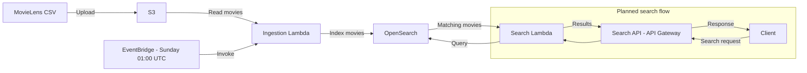

# OpenSearch Movie Search Service

## Overview

The OpenSearch Movie Search Service is a serverless backend designed to provide low-latency movie search and search-as-you-type suggestions for a streaming application.

The project is being developed and tested locally using Floci.

The service will use a MovieLens dataset stored in Amazon S3. An ingestion Lambda will process the dataset and index movie records into Amazon OpenSearch.

A search Lambda will query OpenSearch and return ranked movie results to clients through an API.

The target architecture is:



The stack schedules ingestion every **Sunday at 1:00 AM UTC**.
Each run creates the `movies` index if needed and writes movie IDs, titles, and
genres. Repeated runs update the same movie IDs without adding duplicates; they
do not remove movies missing from the CSV. Uploading a file does not trigger a run.

OpenSearch uses version 2.11, one `t3.small.search` node, and 10 GiB of storage.
The ingestion Lambda uses Python 3.13, 512 MB of memory, and a 15-minute timeout.
The planned search flow sends requests through API Gateway to the search Lambda,
which queries OpenSearch and returns matching movies. The search Lambda is
currently a placeholder; API Gateway and search endpoints are not implemented.

## Run locally

Complete the [project setup](../../README.md) first, including CDK bootstrap.
Run these commands from the repository root with Docker available:

```bash
floci start
eval "$(floci env)"
export AWS_ENDPOINT_URL_S3=http://s3.localhost.floci.io:4566
aws opensearch describe-domain --domain-name movies-search
```

Floci can report a successful stack deployment without creating the OpenSearch
domain. If `movies-search` is missing, create it once through the API:

```bash
aws opensearch create-domain \
  --domain-name movies-search \
  --engine-version OpenSearch_2.11 \
  --cluster-config InstanceType=t3.small.search,InstanceCount=1 \
  --ebs-options EBSEnabled=true,VolumeType=gp2,VolumeSize=10
```

Use real OpenSearch mode (`FLOCI_SERVICES_OPENSEARCH_MOCK=false`). Repeat this check
until `Created` is `true`, `Processing` is `false`, and `Endpoint` is populated:

```bash
aws opensearch describe-domain \
  --domain-name movies-search \
  --query 'DomainStatus.{Created:Created,Processing:Processing,Endpoint:Endpoint}'
```

Deploy the stack, then upload a MovieLens CSV with `movieId`, `title`, and `genres`
columns. Replace `./movies.csv` with your file path:

```bash
npx cdklocal deploy OpenSearchServiceStack
aws s3 cp ./movies.csv s3://movies-data-bucket/raw/movies.csv
```

The weekly schedule takes effect after deployment. Keep Floci and OpenSearch
running at the scheduled time. The manually created domain is managed separately
from the stack. See [Floci's CloudFormation support](https://github.com/floci-io/floci/blob/main/docs/services/cloudformation.md).

## Check ingestion

Run ingestion immediately without waiting for Sunday:

```bash
aws lambda invoke \
  --function-name opensearch-stack-ingestion-lambda \
  --cli-read-timeout 900 \
  /tmp/opensearch-ingestion-result.json
cat /tmp/opensearch-ingestion-result.json
```

Confirm there is no `FunctionError` and the response body reports a positive
`indexed` count with `errors: 0`.

To check the code and stack configuration:

```bash
npm run build
npm test -- --runInBand test/opensearch-service-stack.test.ts
```

Before deploying to AWS, add the missing ingestion permissions for
`es:DescribeDomain`, `es:ESHttpHead`, and the root `/_bulk` endpoint.
