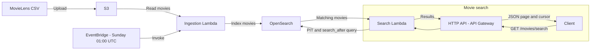

# OpenSearch Movie Search Service

## Overview

The OpenSearch Movie Search Service provides movie title search with typo
tolerance, exact genre filtering, and JSON pagination through API Gateway and
Lambda. It uses a provisioned OpenSearch domain. Search-as-you-type suggestions
(autocomplete) are planned.

The project is being developed and tested locally using Floci.

The service uses a MovieLens dataset stored in Amazon S3. An ingestion Lambda processes the dataset and indexes movie records into Amazon OpenSearch.

A search Lambda queries OpenSearch and returns ranked JSON movie results through an HTTP API. Title search tolerates typos, and an optional exact genre filter narrows results.

The architecture is:


```mermaid
flowchart LR
    dataset[MovieLens CSV] -->|Upload| bucket[S3]
    bucket -->|Read movies| ingestion[Ingestion Lambda]
    schedule[EventBridge - Sunday 01:00 UTC] -->|Invoke| ingestion
    ingestion -->|Index movies| domain[OpenSearch]

    subgraph searchflow [Movie search]
        client[Client] -->|GET /movies/search| api[HTTP API - API Gateway]
        api --> search[Search Lambda]
        search -->|Results| api
        api -->|JSON page and cursor| client
    end
    search -->|PIT and search_after query| domain
    domain -->|Matching movies| search
```

The stack schedules ingestion every **Sunday at 1:00 AM UTC**.
Each run creates the `movies` index if needed and writes movie IDs, titles, and
genres. Repeated runs update the same movie IDs without adding duplicates; they
do not remove movies missing from the CSV. Uploading a file does not trigger a run.

OpenSearch uses version 2.11, one `t3.small.search` node, and 10 GiB of storage.
The ingestion Lambda uses Python 3.13, 512 MB of memory, and a 15-minute timeout.
The search Lambda uses Python 3.13, 512 MB of memory, and a 25-second timeout.
API Gateway invokes it through `GET /movies/search`. Autocomplete remains planned.

## Run locally

Complete the [project setup](../../README.md) first, including CDK bootstrap.
Run these commands from the repository root with Docker available. Configure
the Floci server with real OpenSearch mode (`FLOCI_SERVICES_OPENSEARCH_MOCK=false`)
before creating the domain; this setting belongs to the emulator process.

```bash
# Start the configured local emulator.
floci start

# Configure this terminal to use Floci credentials and endpoints.
eval "$(floci env)"
export AWS_ENDPOINT_URL_S3=http://s3.localhost.floci.io:4566

# Check whether the movies-search domain already exists.
aws opensearch describe-domain --domain-name movies-search
```

Floci can report a successful stack deployment without creating the OpenSearch
domain. If `movies-search` is missing, create it once through the API:

```bash
# Create the local domain only if the previous check reports it is missing.
aws opensearch create-domain \
  --domain-name movies-search \
  --engine-version OpenSearch_2.11 \
  --cluster-config InstanceType=t3.small.search,InstanceCount=1 \
  --ebs-options EBSEnabled=true,VolumeType=gp2,VolumeSize=10
```

Repeat this check until `Created` is `true`, `Processing` is `false`, and `Endpoint` is populated:

```bash
# Wait for the domain to finish provisioning and expose an endpoint.
aws opensearch describe-domain \
  --domain-name movies-search \
  --query 'DomainStatus.{Created:Created,Processing:Processing,Endpoint:Endpoint}'
```

Deploy the stack, then upload a MovieLens CSV with `movieId`, `title`, and `genres`
columns. Replace `./movies.csv` with your file path:

```bash
# Deploy the ingestion schedule, Lambda functions, and search API.
npx cdklocal deploy OpenSearchServiceStack

# Upload the source CSV to the key read by the ingestion Lambda.
aws s3 cp ./movies.csv s3://movies-data-bucket/raw/movies.csv
```

The weekly schedule takes effect after deployment. Keep Floci and OpenSearch
running at the scheduled time. The manually created domain is managed separately
from the stack. See [Floci's CloudFormation support](https://github.com/floci-io/floci/blob/main/docs/services/cloudformation.md).

## Check ingestion

Run ingestion immediately without waiting for Sunday:

```bash
# Invoke ingestion synchronously and save its response; allow up to 15 minutes.
aws lambda invoke \
  --function-name opensearch-stack-ingestion-lambda \
  --cli-read-timeout 900 \
  /tmp/opensearch-ingestion-result.json

# Inspect the returned ingestion result.
cat /tmp/opensearch-ingestion-result.json
```

Confirm there is no `FunctionError` and the response body reports a positive
`indexed` count with `errors: 0`.

Uploading the CSV alone does not invoke ingestion. After a successful run, use
[the search API](#search-movies-through-the-api) or
[direct OpenSearch checks](#manually-search-and-verify-movie-data) to inspect the
indexed data. Build and unit-test commands are in
[Test the search implementation](#test-the-search-implementation).

## Search movies through the API

The demo API requires no authentication. It would also be publicly accessible if
this stack were deployed to AWS. No browser CORS configuration is included.

`GET /movies/search` accepts:

| Parameter | Behavior |
| --- | --- |
| `q` | Title text, trimmed, at most 200 characters. All words must match, with `AUTO` typo tolerance. |
| `genre` | Exact, case-sensitive genre, trimmed, at most 100 characters, such as `Comedy`. |
| `limit` | Integer page size from 1 to 100; defaults to 20. |
| `cursor` | Opaque continuation token from the previous response. |

Supply at least one nonblank `q` or `genre`. Unknown or repeated parameters are
rejected. Title results sort by relevance, then movie ID; genre-only results sort
by movie ID. Typo tolerance operates on title words. It can also return other
similar titles, so an exact spelling and a misspelled query can have different
match counts. Semantic similarity and autocomplete are not implemented.

After completing setup and ingestion above, find the local URL:

```bash
# Configure the AWS CLI and CDK for the running local Floci instance.
eval "$(floci env)"
export AWS_ENDPOINT_URL_S3=http://s3.localhost.floci.io:4566

# Find this API by its configured name.
MOVIES_API_ID=$(aws apigatewayv2 get-apis \
  --query "Items[?Name=='movies-search-api'].ApiId | [0]" --output text)

# Use Floci's host-accessible API route; escape $default so the shell preserves it.
MOVIES_SEARCH_URL="http://localhost:4566/execute-api/${MOVIES_API_ID}/\$default/movies/search"
```

If API discovery returns `None`, confirm that `OpenSearchServiceStack` is deployed
and your shell uses the Floci environment.

CloudFormation also outputs `MoviesSearchApiId` and `MoviesSearchUrl`. On AWS,
use `MoviesSearchUrl` directly. Locally, use the Floci URL above. The Lambda
resolves the internal OpenSearch address itself; your terminal calls API Gateway.

```bash
# Search for a title; --data-urlencode safely encodes spaces and special characters.
curl -sS --max-time 30 --get "$MOVIES_SEARCH_URL" \
  --data-urlencode 'q=Toy Story'

# Verify typo tolerance: stroy should match story.
curl -sS --max-time 30 --get "$MOVIES_SEARCH_URL" \
  --data-urlencode 'q=toy stroy'

# Combine title search with an exact genre filter.
curl -sS --max-time 30 --get "$MOVIES_SEARCH_URL" \
  --data-urlencode 'q=Toy Story' --data-urlencode 'genre=Comedy'

# Search by genre alone and return up to 10 movies.
curl -sS --max-time 30 --get "$MOVIES_SEARCH_URL" \
  --data-urlencode 'genre=Comedy' --data-urlencode 'limit=10'

# Fetch a small first page and save its JSON response.
curl -sS --max-time 30 --get "$MOVIES_SEARCH_URL" \
  --data-urlencode 'q=Toy Story' --data-urlencode 'limit=2' \
  -o /tmp/movies-page.json

# Extract the next cursor using Python; an empty string means there is no next page.
MOVIES_CURSOR=$(python3 -c 'import json; print(json.load(open("/tmp/movies-page.json"))["nextCursor"] or "")')

# Request the next page with the same q, genre (if used), and limit.
if [ -n "$MOVIES_CURSOR" ]; then
  curl -sS --max-time 30 --get "$MOVIES_SEARCH_URL" \
    --data-urlencode 'q=Toy Story' --data-urlencode 'limit=2' \
    --data-urlencode "cursor=$MOVIES_CURSOR"
fi

# Inspect the JSON validation error and HTTP 400 status for a missing search.
curl -sS -i --max-time 30 "$MOVIES_SEARCH_URL"
```

An illustrative successful response for a dataset with one matching movie is
shown below. Actual movies and totals depend on your CSV and query.

```json
{
  "query": "toy stroy",
  "genre": null,
  "total": 1,
  "movies": [
    {
      "movieId": 1,
      "title": "Toy Story (1995)",
      "genres": ["Adventure", "Animation", "Children", "Comedy", "Fantasy"]
    }
  ],
  "nextCursor": null
}
```

| Response field | Meaning |
| --- | --- |
| `query` | Trimmed title query, or `null` for a genre-only search. |
| `genre` | Trimmed genre filter, or `null` when omitted. |
| `total` | Exact match count across all pages of this search snapshot. |
| `movies` | Current page, containing only `movieId`, `title`, and the `genres` array. |
| `nextCursor` | Token to pass on the next request, or `null` after the final page. |

No matches returns HTTP 200 with `total: 0`, `movies: []`, and
`nextCursor: null`. A page can contain fewer movies than `total` because `limit`
controls page size.

Repeat the search with each returned cursor until `nextCursor` is `null` to
retrieve all matches, including searches exceeding 10,000 results. Keep the
normalized search parameters and page size unchanged. Pagination uses an
OpenSearch point-in-time (PIT) snapshot created on the first request. Later pages
use that snapshot and `search_after`, so ingestion changes do not shift the
results. Each page renews the snapshot for five minutes. The final page attempts
to close it; abandoned snapshots and any left by a cleanup failure expire
automatically. Closing a snapshot releases its resources and preserves the movies.

Treat cursors as opaque continuation state and send them with `--data-urlencode`.
They do not authenticate callers. A cursor whose snapshot has expired or has
already been closed returns HTTP 410; restart the search without a cursor to
obtain a fresh snapshot.

Errors use this JSON shape:

```json
{
  "error": {
    "code": "INVALID_REQUEST",
    "message": "Provide q or genre."
  }
}
```

| HTTP status | Meaning |
| --- | --- |
| 400 | Invalid parameters, malformed cursor, or changed search parameters. |
| 410 | Snapshot expired or is no longer available; restart the search. |
| 503 | OpenSearch/index unavailable or incomplete shard results. |
| 504 | Search timed out; retry. |
| 500 | Unexpected internal failure. |

The Lambda logs request IDs, elapsed time, returned counts, and failures. Clients
receive JSON errors without internal exception details.

## Manually search and verify movie data

With Floci and the OpenSearch container running, query OpenSearch directly to
check ingestion and search behavior independently of the HTTP API.

Floci can return an internal Docker endpoint such as `http://172.17.0.5:9200`.
On macOS, that address is not directly reachable from the host when port 9200
is not published, so a host-side `curl` request can hang. Run the queries inside
the OpenSearch container instead. These commands are for the local Floci setup;
an AWS domain may require IAM-signed requests.

Define this helper in your terminal:

```bash
# List running containers and their published ports to locate OpenSearch.
docker ps --format '{{.Names}}\t{{.Ports}}'

# Run curl inside the movies-search container, where localhost:9200 is OpenSearch.
# Limit connection time to 3 seconds and the entire request to 10 seconds.
# Forward all arguments so the helper supports URLs, headers, and query bodies.
os_curl() {
  docker exec floci-opensearch-movies-search \
    curl -sS --connect-timeout 3 --max-time 10 "$@"
}
```

Check the cluster, index, and stored records:

```bash
# Check cluster health and shard allocation; pretty formats the JSON response.
os_curl 'http://localhost:9200/_cluster/health?pretty'

# Confirm the movies index exists and show its status, document count, and size.
os_curl 'http://localhost:9200/_cat/indices/movies?v'

# Return the exact number of searchable movie documents.
os_curl 'http://localhost:9200/movies/_count?pretty'

# Fetch the movie whose document ID is 1; ingestion uses movieId as the document ID.
# Replace 1 with a movieId from your CSV to compare the indexed record with its row.
os_curl 'http://localhost:9200/movies/_doc/1?pretty'

# Return 10 sample movies, ordered by movieId, and count all matching documents.
os_curl 'http://localhost:9200/movies/_search?pretty' \
  -H 'Content-Type: application/json' \
  -d '{
    "size": 10,
    "track_total_hits": true,
    "query": {"match_all": {}},
    "sort": [{"movieId": "asc"}]
  }'
```

Cluster health should be `green` with this project's single-node index settings
(one primary shard and no replicas). `yellow` means some replicas are unassigned;
`red` means some primary shards are unavailable. Check that `_count` matches the
number of unique movie IDs ingested. Existing IDs are updated on repeated runs,
but movies removed from the CSV remain in the index.

For a document lookup, confirm `found` is `true` and compare `_source.movieId`,
`_source.title`, and `_source.genres` against the CSV. Genres are stored as an
array; `(no genres listed)` becomes an empty array. For search responses, inspect
the records under `hits.hits[*]._source`. `size: 10` limits the returned sample,
while `track_total_hits: true` requests the exact total match count.

Try title search and genre filtering:

```bash
# Search the analyzed title field and return up to 10 results ranked by relevance.
# Replace Toy Story with a title you know is present in your CSV.
os_curl 'http://localhost:9200/movies/_search?pretty' \
  -H 'Content-Type: application/json' \
  -d '{
    "size": 10,
    "query": {
      "match": {"title": "Toy Story"}
    }
  }'

# Find movies containing the exact, case-sensitive Comedy genre.
# genres is mapped as keyword, so use term for an exact genre filter.
os_curl 'http://localhost:9200/movies/_search?pretty' \
  -H 'Content-Type: application/json' \
  -d '{
    "size": 10,
    "query": {
      "term": {"genres": "Comedy"}
    }
  }'
```

The title search should return relevant movies from your dataset. Every result
from the genre query should contain `Comedy` in its `genres` array. Compare a few
known movies with the source CSV to verify field values as well as search behavior.

## OpenSearch permissions

The policies in [the stack definition](../../lib/opensearch-service-stack.ts)
are attached to the search Lambda's execution role. Each statement grants an
operation (`actions`) on a domain or API path (`resources`). `domainArn` identifies
the OpenSearch domain; appending a path limits the permission to that endpoint.

| IAM action | Resource suffix | Request and purpose |
| --- | --- | --- |
| `es:DescribeDomain` | Domain ARN itself | Discover the domain endpoint before connecting. |
| `es:ESHttpPost` | `/movies/_search/point_in_time` | Create a PIT snapshot of the movies index. |
| `es:ESHttpPost` | `/_search` | Search the PIT and fetch subsequent result pages. |
| `es:ESHttpDelete` | `/_search/point_in_time` | Close the PIT after the last page to free snapshot resources. |

`/_search` and `/_search/point_in_time` are root endpoints under the domain URL.
The PIT ID in the request body identifies the index snapshot, so subsequent
search requests do not put `/movies` in the URL. The DELETE permission closes
snapshots; it does not grant deletion of movie documents or the movies index.

These permissions restrict HTTP methods and paths. IAM's permission for the root
`/_search` endpoint is not itself restricted to the movies index; the Lambda
creates its PITs from `movies`. Stronger index-level authorization would require
additional OpenSearch access controls.

The Lambda resolves the endpoint at runtime because Floci can supply a synthetic
CDK domain endpoint. Connections to local OpenSearch use unsigned HTTP; AWS
OpenSearch connections use verified HTTPS and SigV4 signing. The client is reused
across warm Lambda invocations.

The ingestion Lambda has separate permissions. Before deploying this demo to
AWS, add its missing `es:DescribeDomain`, `es:ESHttpHead`, and root `/_bulk`
permissions. The search-role statements above do not grant permissions to
ingestion. Also review the unauthenticated API, fixed bucket names, and destructive
removal policies described in [Local vs real AWS](../../README.md#local-vs-real-aws).

## Test the search implementation

```bash
# Type-check the CDK app.
npm run build

# Check infrastructure resources and permissions; Docker is needed for bundling.
npm test -- --runInBand

# Create an isolated Python environment for the Lambda unit tests.
python3 -m venv /tmp/floci-movie-search-venv

# Install the runtime client plus boto3, which AWS provides in the Lambda runtime.
/tmp/floci-movie-search-venv/bin/pip install boto3 \
  -r stacks/opensearch-service-stack/lambda/opensearch_search_lambda/requirements.txt

# Run mocked search, pagination, validation, failure, and connection tests.
/tmp/floci-movie-search-venv/bin/python -m unittest discover -s test/python -v
```
